# Skills

Reusable AI agent workflows for this project. Each skill lives in its own
directory as a `SKILL.md` file, optionally accompanied by supporting reference
files.

These skills and rules are **shared across multiple projects and repos**.

During development, projects are brought into the scope as git submodules.

Skill, agents, and rules are managed as separate repo - a single source of truth.

## Naming conventions

Skill names have three layers: **prefix**, **area**, and **specific**.

```
act-dev--scraper-write
^^^ ^^^  ^^^^^^^^^^^^^
 |    |    └─ specific: object-action within the area
 |    └─ area: broad domain of work
 └─ prefix: class of behavior
```

### Layer 1: Prefix (class of behavior)

Prefixes classify **when** a skill runs. These rarely change -- adding a new
prefix would mean discovering an entirely new class of behavior.

| Prefix     | When it runs                                                 |
| ---------- | ------------------------------------------------------------ |
| `root-`    | Root-repo management. Configuring this repo itself (submodules, etc.). |
| `project-` | One-time setup. Run once per project or major milestone.     |
| `act-`     | Reactive. Triggered by an event (bug report, release, etc.). |
| `meta-`    | Self-referential. Skills about the skill system itself.      |

### Layer 2: Area (domain of work) -- optional

Areas group skills by the broad domain they operate in. This layer is
**optional** -- it only makes sense when there are enough skills in a
prefix that an extra grouping level improves clarity.

For example, `act-` has enough skills that grouping them under `dev`,
`repo`, and `security` helps navigation. But `project-` and `meta-` skills
are few enough that their names go straight from prefix to specific
(e.g. `project-setup`, `meta-discovery`) -- adding an area would be
unnecessary indirection.

Current areas under `act-`:

| Area       | Scope                                                      | Example                  |
| ---------- | ---------------------------------------------------------- | ------------------------ |
| `dev`      | Writing code: features, bugs, refactors, tests, benchmarks | `act-dev--scraper-write` |
| `repo`     | Git and GitHub operations: PRs, issues, releases           | `act-repo-pr-create`     |
| `security` | Security concerns: vulnerability handling, audits          | `act-security-vuln`      |

Areas are more likely to evolve than prefixes -- new areas emerge when
recurring work doesn't fit an existing one. For example, there's no `ops`
area for deployment or `data` for data pipelines yet.

### Layer 3: Specific (object-action)

The most granular part of the name. Follows an **object-action** pattern
(noun first, verb second), similar to REST resources or Object-oriented programming -- the noun is
the thing being acted on, and the verb is what you do to it.

```
act-repo-pr-create  →  pr (object) + create (action)
```

**When to omit the verb:** If there's only one meaningful action for the
noun, the verb is redundant. For example, `act-dev-changelog` -- the only
thing you do to a changelog is update it, so `-update` adds no information.

**When to keep the verb:** If the noun alone would be ambiguous because
multiple actions apply. For example, `act-dev--dependency-migrate` --
during development you routinely add, remove, and update dependencies, so
the verb clarifies which workflow this skill covers.

### Sub-specialization with `--`

When a skill narrows a broader area skill to a specific use case, a
double-hyphen separates the area from the specialization:
`act-{area}--{object-action}`. The parent (`act-{area}`) is the general
orchestrator; the child is a focused variant.

### Skill catalog

#### `root-` -- Root-repo management

Reserved for managing the root repo. Do not use for skills that operate on imported projects.

| Skill          | Purpose                                                                 |
| -------------- | ----------------------------------------------------------------------- |
| `root-gitmodule-setup`  | Configure git submodules: add projects, remove projects, switch between projects. Asks for repo URL and branch when adding; stores progress before removing; reminds about window reload. |

#### `project-` -- One-time setup

| Skill                    | Purpose                                                       |
| ------------------------ | ------------------------------------------------------------- |
| `project-setup`          | Scaffold a new project from scratch                           |
| `project-setup-monorepo` | Set up pnpm monorepo: workspaces, catalogs, shared config, CI |
| `project-polish`         | Add maturity signals (CI, community health, Dependabot, etc.) |
| `project-polish-bench`   | Set up benchmarking infrastructure                            |
| `project-polish-docs`    | Write or restructure developer documentation                  |

#### `act-` -- Reactive / event-driven

| Skill                         | Purpose                                                                                       |
| ----------------------------- | --------------------------------------------------------------------------------------------- |
| `act-dev`                     | **Orchestrator.** End-to-end development workflow (design through PR)                         |
| `act-dev-design`              | Phase skill. Analyze request, explore code, draft implementation plan                         |
| `act-dev-coverage`            | Phase skill. Improve test coverage                                                            |
| `act-dev-bench`               | Phase skill. Write benchmark tests                                                            |
| `act-dev-validate`            | Phase skill. Check cross-system constraint drift                                              |
| `act-dev-docs`                | Phase skill. Update docs and docstrings after code changes                                    |
| `act-dev-changelog`           | Phase skill. Add changelog entry                                                              |
| `act-dev-reviewer`           | Phase skill. Launch adversarial reviewer subagent to check work before presenting             |
| `act-dev--scraper-write`         | Specialization of `act-dev`. Create or modify a scraper (scaffold, routes, extraction)        |
| `act-dev--scraper-discovery`   | Specialization of `act-dev`. Discover and design scraping (pages, data, layout variants). WIP |
| `act-dev--scraper-data-integrity` | Specialization of `act-dev`. Validate data integrity of scraped datasets (audit, checks, tooling). WIP |
| `act-dev--dependency-manage`  | Specialization of `act-dev`. Add, update, or remove deps via pnpm catalog                     |
| `act-dev--dependency-migrate` | Specialization of `act-dev`. Evaluate and apply dependency migrations                         |
| `act-dev--package-create`     | Specialization of `act-dev`. Create a new monorepo package                                    |
| `act-dev--package-migrate-in` | Specialization of `act-dev`. Migrate an external package into the monorepo                    |
| `act-repo-pr-create`          | Create a GitHub pull request                                                                  |
| `act-repo-issue-create`       | Create a GitHub issue                                                                         |
| `act-repo-release`            | Prepare and publish a release                                                                 |
| `act-security-vuln`           | Handle a security vulnerability report                                                        |

#### `meta-` -- Skills about skills

| Skill                | Purpose                                                                                             |
| -------------------- | --------------------------------------------------------------------------------------------------- |
| `meta-discovery`     | Evaluate whether the current task reveals a pattern worth capturing as a new skill                  |
| `meta-skill-write`   | Conventions for creating and organizing skills                                                      |

## How skills connect

```mermaid
flowchart TD
    %% ── Act-dev orchestrator and its phases ──────────────────────
    dev["<b>act-dev</b><br/>Development orchestrator"]

    design["act-dev-design<br/><i>Design & plan</i>"]
    coverage["act-dev-coverage<br/><i>Tests</i>"]
    bench["act-dev-bench<br/><i>Benchmarks</i>"]
    validate["act-dev-validate<br/><i>Validation</i>"]
    docs["act-dev-docs<br/><i>Doc updates</i>"]
    changelog["act-dev-changelog<br/><i>Changelog</i>"]
    reviewer["act-dev-reviewer<br/><i>Reviewer subagent</i>"]
    pr["act-repo-pr-create<br/><i>Pull request</i>"]
    discovery["meta-discovery<br/><i>Pattern discovery</i>"]

    dev -->|"Phase 1"| design
    dev -->|"Phase 3"| coverage
    dev -->|"Phase 4"| bench
    dev -->|"Phase 5"| validate
    dev -->|"Phase 6"| docs
    dev -->|"Phase 7"| changelog
    dev -->|"Phase 8b"| reviewer
    dev -->|"Phase 10"| pr
    dev -->|"Phase 11"| discovery

    %% ── Specializations of act-dev ───────────────────────────────
    scraper["act-dev--scraper-write"]
    scraperdisc["act-dev--scraper-discovery"]
    scraperintegrity["act-dev--scraper-data-integrity"]
    depmgr["act-dev--dependency-manage"]
    depup["act-dev--dependency-migrate"]
    pkgcreate["act-dev--package-create"]
    pkgmigrate["act-dev--package-migrate-in"]

    scraper -.->|"specializes"| dev
    scraperintegrity -.->|"specializes"| dev
    depmgr -.->|"specializes"| dev
    depup -.->|"specializes"| dev
    depup -.->|"mechanics via"| depmgr
    pkgcreate -.->|"specializes"| dev
    pkgmigrate -.->|"specializes"| dev
    pkgmigrate -.->|"scaffolds via"| pkgcreate

    %% ── Project setup chain ──────────────────────────────────────
    setup["<b>project-setup</b><br/>Scaffold project"]
    monorepo["project-setup-monorepo<br/><i>Monorepo setup</i>"]
    polish["<b>project-polish</b><br/>Maturity signals"]
    polishbench["project-polish-bench<br/><i>Benchmark infra</i>"]
    polishdocs["project-polish-docs<br/><i>Documentation</i>"]

    setup -->|"if monorepo"| monorepo
    setup -->|"then"| polish
    setup -->|"then"| polishdocs
    monorepo -.->|"ongoing deps"| depmgr
    polish -->|"delegates"| polishbench
    polish -->|"delegates"| polishdocs

    %% ── Cross-references between act and project ─────────────────
    bench -.->|"infra setup via"| polishbench
    validate -.->|"infra setup via"| polish
    docs -.->|"tone guide from"| polishdocs

    %% ── Meta ─────────────────────────────────────────────────────
    skillwrite["meta-skill-write<br/><i>Skill conventions</i>"]
    discovery -.->|"creates via"| skillwrite

    %% ── Root repo management ─────────────────────────────────────
    rootsetup["root-gitmodule-setup<br/><i>Submodule config</i>"]

    %% ── Standalone act skills ────────────────────────────────────
    issue["act-repo-issue-create"]
    release["act-repo-release"]
    secvuln["act-security-vuln"]

    release -->|"uses"| changelog

    %% ── Styling ──────────────────────────────────────────────────
    classDef orchestrator fill:#4a90d9,color:#fff,stroke:#2a6cb8
    classDef phase fill:#7ab648,color:#fff,stroke:#5a9428
    classDef specialization fill:#f5a623,color:#fff,stroke:#d48b0a
    classDef project fill:#9b59b6,color:#fff,stroke:#7d3c98
    classDef meta fill:#95a5a6,color:#fff,stroke:#7f8c8d
    classDef root fill:#1abc9c,color:#fff,stroke:#16a085
    classDef standalone fill:#e74c3c,color:#fff,stroke:#c0392b

    class dev orchestrator
    class rootsetup root
    class design,coverage,bench,validate,docs,changelog,reviewer,pr phase
    class scraper,scraperdisc,scraperintegrity,depup,pkgcreate,pkgmigrate specialization
    class setup,polish,polishbench,polishdocs project
    class discovery,skillwrite meta
    class issue,release,secvuln standalone
```



### Reading the diagram

| Arrow style               | Meaning                                                                                               |
| ------------------------- | ----------------------------------------------------------------------------------------------------- |
| **Solid arrow** (`-->`)   | Direct delegation. The source skill invokes the target as a phase or step.                            |
| **Dashed arrow** (`-.->`) | Cross-reference. The source skill refers to the target for setup, conventions, or optional follow-up. |

| Color  | Category                                   |
| ------ | ------------------------------------------ |
| Blue   | Orchestrator (`act-dev`)                   |
| Green  | Phase skills (invoked by the orchestrator) |
| Orange | Specializations (`act-dev--*`)             |
| Purple | Project setup skills (`project-*`)         |
| Gray   | Meta skills (`meta-*`)                     |
| Teal   | Root-repo skills (`root-*`)                |
| Red    | Standalone act skills                      |

### Key relationships

- **`act-dev` is the main orchestrator.** It delegates to phase skills in
  sequence: design, implement, test, benchmark, validate, document, changelog,
  self-review, PR, and pattern discovery.

- **Specializations** (`act-dev--*`) are narrower workflows that build on
  `act-dev`. They handle specific scenarios (scaffold scraper, update
  dependency, create/migrate package) while inheriting the orchestrator's
  phase structure.

- **Project skills** form their own chain. `project-setup` scaffolds from
  scratch. If the project is a monorepo, `project-setup-monorepo` adds
  workspaces, catalogs, shared config, and CI. Then `project-polish` (CI,
  health files) and `project-polish-docs` (README, guides) add maturity
  signals. `project-polish` further delegates to `project-polish-bench` for
  benchmarking infrastructure.

- **Phase skills cross-reference project skills** for initial infrastructure
  setup. For example, `act-dev-bench` points to `project-polish-bench` if
  the benchmarking infrastructure hasn't been set up yet.

- **`root-gitmodule-setup`** manages this root repo's git submodules (add, remove, switch).
  It asks for repo URL and branch when adding; offers progress storage before
  removing; and reminds about window reload after submodule changes.

- **`meta-discovery`** runs after every substantive interaction. If it
  identifies a new pattern, it hands off to `meta-skill-write` for skill
  creation (with user approval).

- **`act-repo-release`** uses `act-dev-changelog` to ensure the changelog
  is up to date before publishing.
