# Skills

Reusable AI agent workflows for this project. Each skill lives in its own
directory as a `SKILL.md` file, optionally accompanied by supporting reference
files.

These skills and rules are **shared across multiple projects and repos**.

During development, projects are brought into scope as nested git clones.

Skill, agents, and rules are managed as separate repo - a single source of truth.

**Language focus:** These skills are currently tuned for Node.js/TypeScript projects (npm, pnpm, Vitest, etc.). Support for Python and Rust may be added in the future.

### Folder structure

Skills are grouped by prefix into folders for easier navigation:

| Folder     | Prefix   | Example skills                          |
| ---------- | -------- | --------------------------------------- |
| `act/`     | act-     | dev, dev--scraper-write, repo-pr-create |
| `role/`    | role-    | pm, worker, architect, reviewer         |
| `project/` | project- | setup, polish, polish-docs              |
| `meta/`    | meta-    | skill-create, agent-create, hook-create |
| `root/`    | root-    | project-setup                           |

The skill _name_ matches the path: `act/dev` → `act-dev`, `role/pm` → `role-pm`.

## Common commands

Natural phrases that trigger skills. Say these in chat to invoke workflows.

| You might say…                                                                          | Skill(s)                                                                                    |
| --------------------------------------------------------------------------------------- | ------------------------------------------------------------------------------------------- |
| **"capture this"**, "add to backlog", "I have an idea"                                  | `role-pm` — Capture ideas to INBOX                                                          |
| **"triage my backlog"**, "process inbox", "sort my TODOs"                               | `role-pm` — Triage captured items                                                           |
| **"what's next?"**, "prioritize", "I'm lost"                                            | `role-pm` — Suggest focus options                                                           |
| **"what was I doing?"**, "where did I leave off?", "context restore"                    | `role-pm` — Restore session context                                                         |
| **"wrap up"**, "end of session"                                                         | `role-pm` — Session wrap-up                                                                 |
| **"worker"**, "implement from pool", "take issues #5 #6"                                | `role-worker` — Pool-based execution; implement issues, close when done                     |
| **"implement"**, **"develop"**, "build", "add", "fix"                                   | `act-dev` — End-to-end dev workflow                                                         |
| **"plan"**, "design", "figure out how to implement"                                     | `act-dev-design` — Implementation plan                                                      |
| **"scrape"**, "create a scraper", "new Apify actor"                                     | `act-dev--scraper-write`                                                                    |
| "explore this site", "design the scraping"                                              | `act-dev--scraper-discovery`                                                                |
| "add dependency", "bump version", "how do I add a dep?"                                 | `act-dev--dependency-manage`                                                                |
| "migrate dependency", "Dependabot PR", "check compatibility"                            | `act-dev--dependency-migrate`                                                               |
| "create package", "add package", "scaffold package"                                     | `act-dev--package-create`                                                                   |
| "migrate package in", "absorb", "bring in package"                                      | `act-dev--package-migrate-in`                                                               |
| "coverage", "test gaps", "improve tests"                                                | `act-dev-coverage`                                                                          |
| "benchmark", "performance tracking"                                                     | `act-dev-bench`                                                                             |
| "update docs", "docs up to date"                                                        | `act-dev-docs`                                                                              |
| "changelog", "document changes"                                                         | `act-dev-changelog`                                                                         |
| **"create PR"**, "open pull request", "push and create PR"                              | `act-repo-pr-create`                                                                        |
| "file an issue", "create issue"                                                         | `act-repo-issue-create`                                                                     |
| **"release"**, "publish", "cut a release"                                               | `act-repo-release`                                                                          |
| **"architect"**, "design and break down", "how would we implement", "break into issues" | `role-architect` — Design large work, create issues, hand off to PM                         |
| "hand to architect", "narrow these solutions", "deep dive into these"                   | `act-arch-solution-create` — Multi-solution flow: narrow, deep-dive, iterate, create issues |
| "create AI crew", "AI committee", "multi-agent workflow", "CrewAI-style"                | `act-ai-crew-create` — Design and implement KaibanJS crew                                   |
| "run AI crew", "run crew-prd-review", "execute crew"                                    | `act-ai-crew-run` — Pass inputs, invoke crew script                                         |
| "set up project", "scaffold", "bootstrap"                                               | `project-setup`                                                                             |
| "add Cursor hooks", "create hook", "beforeSubmitPrompt"                                 | `meta-hook-create`                                                                          |
| "project polish", "community health", "make it professional"                            | `project-polish`                                                                            |
| "write docs", "improve README", "restructure docs"                                      | `project-polish-docs`                                                                       |
| "benchmark infrastructure", "performance CI"                                            | `project-polish-bench`                                                                      |
| "add project", "remove project", **"switch projects"**                                  | `root-project-setup`                                                                        |
| "create agent", "new role"                                                              | `meta-agent-create`                                                                         |
| "create skill", "skill conventions", "update skill"                                     | `meta-skill-create`                                                                         |
| "create skills from project", "capture project patterns", "onboard agent"               | `meta-create-skills-from-project`                                                           |

_Bold_ = common shorthand. Skills auto-trigger when intent matches; explicit phrases help.

## Naming conventions

Skill names have three layers: **prefix**, **area**, and **specific**.

```
act-dev--scraper-write
^^^ ^^^  ^^^^^^^^^^^^^
 |    |    └─ specific: object-action within the area
 |    └─ area: broad domain of work
 └─ prefix: class of behavior
```

### Layer 1: Prefix (class of behavior)

Prefixes classify **when** a skill runs. These rarely change -- adding a new
prefix would mean discovering an entirely new class of behavior.

| Prefix     | When it runs                                                                                         |
| ---------- | ---------------------------------------------------------------------------------------------------- |
| `root-`    | Root-repo management. Configuring this repo itself (imported nested projects, ignore toggles, etc.). |
| `project-` | One-time setup. Run once per project or major milestone.                                             |
| `act-`     | Reactive. Triggered by an event (bug report, release, etc.).                                         |
| `role-`    | Agent persona behaviors. The "how" for agents (pm, architect, worker, reviewer).         |
| `meta-`    | Self-referential. Skills about the skill system itself.                                              |

### Layer 2: Area (domain of work) -- optional

Areas group skills by the broad domain they operate in. This layer is
**optional** -- it only makes sense when there are enough skills in a
prefix that an extra grouping level improves clarity.

For example, `act-` has enough skills that grouping them under `dev`,
`repo`, and `security` helps navigation. But `project-` and `meta-` skills
are few enough that their names go straight from prefix to specific
(e.g. `project-setup`, `meta-discovery`) -- adding an area would be
unnecessary indirection.

Current areas under `act-`:

| Area       | Scope                                                                                                                 | Example                                 |
| ---------- | --------------------------------------------------------------------------------------------------------------------- | --------------------------------------- |
| `dev`      | Writing code: features, bugs, refactors, tests, benchmarks                                                            | `act-dev--scraper-write`                |
| `arch`     | Architecture and composition (1–2 layers above dev): new data kinds, processes, system boundaries; not implementation | `act-arch-solution-create`              |
| `repo`     | Git and GitHub operations: PRs, issues, releases                                                                      | `act-repo-pr-create`                    |
| `security` | Security concerns: vulnerability handling, audits                                                                     | `act-security-vuln`                     |
| `ai`       | AI/LLM-based workflows: crews, committees, multi-agent tasks                                                          | `act-ai-crew-create`, `act-ai-crew-run` |

Agent role skills (`role-`) don't use areas.

**Dev vs arch:** `dev` is code-level (e.g. "add a table to the DB"). `arch` is composition-level (e.g. "we need a new kind of data and independent processes"; "sales need a platform to aggregate intel on leads").

Areas are more likely to evolve than prefixes -- new areas emerge when
recurring work doesn't fit an existing one. For example, there's no `ops`
area for deployment or `data` for data pipelines yet.

### Layer 3: Specific (object-action)

The most granular part of the name. Follows an **object-action** pattern
(noun first, verb second), similar to REST resources or Object-oriented programming -- the noun is
the thing being acted on, and the verb is what you do to it.

```
act-repo-pr-create  →  pr (object) + create (action)
```

**When to omit the verb:** If there's only one meaningful action for the
noun, the verb is redundant. For example, `act-dev-changelog` -- the only
thing you do to a changelog is update it, so `-update` adds no information.

**When to keep the verb:** If the noun alone would be ambiguous because
multiple actions apply. For example, `act-dev--dependency-migrate` --
during development you routinely add, remove, and update dependencies, so
the verb clarifies which workflow this skill covers.

### Sub-specialization with `--`

When a skill narrows a broader area skill to a specific use case, a
double-hyphen separates the area from the specialization:
`act-{area}--{object-action}`. The parent (`act-{area}`) is the general
orchestrator; the child is a focused variant.

### Skill catalog

#### `root-` -- Root-repo management

Reserved for managing the root repo. Do not use for skills that operate on imported projects.

| Skill                | Purpose                                                                                                                                                                                                   |
| -------------------- | --------------------------------------------------------------------------------------------------------------------------------------------------------------------------------------------------------- |
| `root-project-setup` | Configure imported nested project clones: add projects, remove projects, switch between projects. Asks for repo URL and branch when adding; stores progress before removing; reminds about window reload. |

#### `project-` -- One-time setup

| Skill                    | Purpose                                                       |
| ------------------------ | ------------------------------------------------------------- |
| `project-setup`          | Scaffold a new project from scratch                           |
| `project-setup-monorepo` | Set up pnpm monorepo: workspaces, catalogs, shared config, CI |
| `project-polish`         | Add maturity signals (CI, community health, Dependabot, etc.) |
| `project-polish-bench`   | Set up benchmarking infrastructure                            |
| `project-polish-docs`    | Write or restructure developer documentation                  |

#### `act-` -- Reactive / event-driven

| Skill                             | Purpose                                                                                                                                           |
| --------------------------------- | ------------------------------------------------------------------------------------------------------------------------------------------------- |
| `act-dev`                         | **Orchestrator.** End-to-end development workflow (design through PR)                                                                             |
| `act-dev-design`                  | Phase skill. Analyze request, explore code, draft implementation plan                                                                             |
| `act-dev-coverage`                | Phase skill. Improve test coverage                                                                                                                |
| `act-dev-bench`                   | Phase skill. Write benchmark tests                                                                                                                |
| `act-dev-validate`                | Phase skill. Check cross-system constraint drift                                                                                                  |
| `act-dev-docs`                    | Phase skill. Update docs and docstrings after code changes                                                                                        |
| `act-dev-changelog`               | Phase skill. Add changelog entry                                                                                                                  |
| `act-dev-review`                  | Phase skill. Invoke reviewer subagent after substantive work. Part of act-dev Phase 8b.                                                           |
| `act-dev--scraper-write`          | Specialization of `act-dev`. Create or modify a scraper (scaffold, routes, extraction)                                                            |
| `act-dev--scraper-discovery`      | Specialization of `act-dev`. Discover and design scraping (pages, data, layout variants). WIP                                                     |
| `act-dev--scraper-data-integrity` | Specialization of `act-dev`. Validate data integrity of scraped datasets (audit, checks, tooling). WIP                                            |
| `act-dev--dependency-manage`      | Specialization of `act-dev`. Add, update, or remove deps via pnpm catalog                                                                         |
| `act-dev--dependency-migrate`     | Specialization of `act-dev`. Evaluate and apply dependency migrations                                                                             |
| `act-dev--package-create`         | Specialization of `act-dev`. Create a new monorepo package                                                                                        |
| `act-dev--package-migrate-in`     | Specialization of `act-dev`. Migrate an external package into the monorepo                                                                        |
| `act-repo-pr-create`              | Create a GitHub pull request                                                                                                                      |
| `act-repo-issue-create`           | Create a GitHub issue                                                                                                                             |
| `act-repo-release`                | Prepare and publish a release                                                                                                                     |
| `act-security-vuln`               | Handle a security vulnerability report                                                                                                            |
| `act-arch-solution-create`        | Architect-led: when expert produced multiple solutions — narrow with user, deep-dive, iterate, prioritize, create umbrella + work-package issues. |
| `act-ai-crew-create`              | Create KaibanJS crew/committee: gather context, define strategy, agents, generate src/crews/{name}.ts using config.ts tiers.                  |
| `act-ai-crew-run`                 | Run existing AI crew: pass inputs (file, stdin, programmatic), handle output, env vars.                                                           |

#### `role-` — Agent personas (behaviors for agent definitions)

| Skill             | Purpose                                                                                                                                               |
| ----------------- | ----------------------------------------------------------------------------------------------------------------------------------------------------- |
| `role-pm`         | Project manager: capture ideas, triage backlog, "what's next?", context restore. First local, then GitHub.                                            |
| `role-architect`  | Architect: design and break down large work into issues; hand off to PM for prioritization. Start with most straightforward chunk.                    |
| `role-worker`     | Worker: execute from pool of GitHub issues; take one, implement via act-dev, close when done. Used for parallel execution after architect/PM handoff. |
| `role-reviewer`   | Adversarial reviewer: prompt template and instructions. Used when the reviewer subagent is invoked.                                                   |

#### `meta-` -- Skills about skills

| Skill                             | Purpose                                                                               |
| --------------------------------- | ------------------------------------------------------------------------------------- |
| `meta-discovery`                  | Evaluate whether the current task reveals a pattern worth capturing as a new skill    |
| `meta-skill-create`               | Conventions for creating and organizing skills                                        |
| `meta-create-skills-from-project` | Create skills from an existing project's patterns (onboarding, capturing conventions) |
| `meta-agent-create`               | Create new agents/roles: discovery prompt, trigger docs, codebase updates             |
| `meta-hook-create`                | Create Cursor lifecycle hooks (beforeSubmitPrompt, etc.); capture-prompts as example  |

## How skills connect

```mermaid
flowchart TD
    %% ── Act-dev orchestrator and its phases ──────────────────────
    dev["<b>act-dev</b><br/>Development orchestrator"]

    design["act-dev-design<br/><i>Design & plan</i>"]
    coverage["act-dev-coverage<br/><i>Tests</i>"]
    bench["act-dev-bench<br/><i>Benchmarks</i>"]
    validate["act-dev-validate<br/><i>Validation</i>"]
    docs["act-dev-docs<br/><i>Doc updates</i>"]
    changelog["act-dev-changelog<br/><i>Changelog</i>"]
    reviewer["role-reviewer<br/><i>Reviewer prompt</i>"]
    devreview["act-dev-review<br/><i>Invoke reviewer (Phase 8b)</i>"]
    pr["act-repo-pr-create<br/><i>Pull request</i>"]
    discovery["meta-discovery<br/><i>Pattern discovery</i>"]

    dev -->|"Phase 1"| design
    dev -->|"Phase 3"| coverage
    dev -->|"Phase 4"| bench
    dev -->|"Phase 5"| validate
    dev -->|"Phase 6"| docs
    dev -->|"Phase 7"| changelog
    dev -->|"Phase 8b"| devreview
    devreview -.->|"uses prompt from"| reviewer
    dev -->|"Phase 10"| pr
    reviewer -.->|"includes"| discovery

    %% ── Specializations of act-dev ───────────────────────────────
    scraper["act-dev--scraper-write"]
    scraperdisc["act-dev--scraper-discovery"]
    scraperintegrity["act-dev--scraper-data-integrity"]
    depmgr["act-dev--dependency-manage"]
    depup["act-dev--dependency-migrate"]
    pkgcreate["act-dev--package-create"]
    pkgmigrate["act-dev--package-migrate-in"]

    scraper -.->|"specializes"| dev
    scraperintegrity -.->|"specializes"| dev
    depmgr -.->|"specializes"| dev
    depup -.->|"specializes"| dev
    depup -.->|"mechanics via"| depmgr
    pkgcreate -.->|"specializes"| dev
    pkgmigrate -.->|"specializes"| dev
    pkgmigrate -.->|"scaffolds via"| pkgcreate

    %% ── Project setup chain ──────────────────────────────────────
    setup["<b>project-setup</b><br/>Scaffold project"]
    monorepo["project-setup-monorepo<br/><i>Monorepo setup</i>"]
    polish["<b>project-polish</b><br/>Maturity signals"]
    polishbench["project-polish-bench<br/><i>Benchmark infra</i>"]
    polishdocs["project-polish-docs<br/><i>Documentation</i>"]

    setup -->|"if monorepo"| monorepo
    setup -->|"then"| polish
    setup -->|"then"| polishdocs
    monorepo -.->|"ongoing deps"| depmgr
    polish -->|"delegates"| polishbench
    polish -->|"delegates"| polishdocs

    %% ── Cross-references between act and project ─────────────────
    bench -.->|"infra setup via"| polishbench
    validate -.->|"infra setup via"| polish
    docs -.->|"tone guide from"| polishdocs

    %% ── Meta ─────────────────────────────────────────────────────
    skillcreate["meta-skill-create<br/><i>Skill conventions</i>"]
    createskills["meta-create-skills-from-project<br/><i>Create skills from project</i>"]
    agentcreate["meta-agent-create<br/><i>Create agents</i>"]
    discovery -.->|"creates via"| skillcreate
    createskills -.->|"uses"| skillcreate
    agentcreate -.->|"produces"| pm

    %% ── Root repo management ─────────────────────────────────────
    rootsetup["root-project-setup<br/><i>Nested clone config</i>"]

    %% ── Standalone act skills ────────────────────────────────────
    issue["act-repo-issue-create"]
    release["act-repo-release"]
    secvuln["act-security-vuln"]
    pm["role-pm<br/><i>Capture, triage, prioritize</i>"]
    architect["role-architect<br/><i>Design, break down, create issues</i>"]
    archsolution["act-arch-solution-create<br/><i>Multi-solution narrow & create</i>"]
    worker["role-worker<br/><i>Pool execution, close when done</i>"]

    release -->|"uses"| changelog
    pm -.->|"promote via"| issue
    architect -.->|"creates via"| issue
    architect -.->|"handoff"| pm
    architect -.->|"pool for"| worker
    pm -.->|"distribute to"| worker
    worker -.->|"implements via"| dev
    archsolution -.->|"specializes"| architect
    archsolution -.->|"creates via"| issue

    %% ── Styling ──────────────────────────────────────────────────
    classDef orchestrator fill:#4a90d9,color:#fff,stroke:#2a6cb8
    classDef phase fill:#7ab648,color:#fff,stroke:#5a9428
    classDef specialization fill:#f5a623,color:#fff,stroke:#d48b0a
    classDef project fill:#9b59b6,color:#fff,stroke:#7d3c98
    classDef meta fill:#95a5a6,color:#fff,stroke:#7f8c8d
    classDef root fill:#1abc9c,color:#fff,stroke:#16a085
    classDef standalone fill:#e74c3c,color:#fff,stroke:#c0392b

    class dev orchestrator
    class rootsetup root
    class design,coverage,bench,validate,docs,changelog,devreview,pr phase
    class scraper,scraperdisc,scraperintegrity,depup,pkgcreate,pkgmigrate specialization
    class setup,polish,polishbench,polishdocs project
    class discovery,skillcreate meta
    class issue,release,secvuln,pm,evangelist,architect,worker,archsolution standalone
```



### Reading the diagram

| Arrow style               | Meaning                                                                                               |
| ------------------------- | ----------------------------------------------------------------------------------------------------- |
| **Solid arrow** (`-->`)   | Direct delegation. The source skill invokes the target as a phase or step.                            |
| **Dashed arrow** (`-.->`) | Cross-reference. The source skill refers to the target for setup, conventions, or optional follow-up. |

| Color  | Category                                   |
| ------ | ------------------------------------------ |
| Blue   | Orchestrator (`act-dev`)                   |
| Green  | Phase skills (invoked by the orchestrator) |
| Orange | Specializations (`act-dev--*`)             |
| Purple | Project setup skills (`project-*`)         |
| Gray   | Meta skills (`meta-*`)                     |
| Teal   | Root-repo skills (`root-*`)                |
| Red    | Standalone act skills                      |

### Key relationships

- **`act-dev` is the main orchestrator.** It delegates to phase skills in
  sequence: design, implement, test, benchmark, validate, document, changelog,
  self-review, PR, and pattern discovery.

- **Specializations** (`act-dev--*`) are narrower workflows that build on
  `act-dev`. They handle specific scenarios (scaffold scraper, update
  dependency, create/migrate package) while inheriting the orchestrator's
  phase structure.

- **Project skills** form their own chain. `project-setup` scaffolds from
  scratch. If the project is a monorepo, `project-setup-monorepo` adds
  workspaces, catalogs, shared config, and CI. Then `project-polish` (CI,
  health files) and `project-polish-docs` (README, guides) add maturity
  signals. `project-polish` further delegates to `project-polish-bench` for
  benchmarking infrastructure.

- **Phase skills cross-reference project skills** for initial infrastructure
  setup. For example, `act-dev-bench` points to `project-polish-bench` if
  the benchmarking infrastructure hasn't been set up yet.

- **`root-project-setup`** manages this root repo's imported nested projects (add, remove, switch).
  It asks for repo URL and branch when adding; offers progress storage before
  removing; and reminds about window reload after project import changes.

- **`meta-discovery`** runs as part of the reviewer subagent.
  When the reviewer runs, it evaluates for skill discovery. If it identifies a new
  pattern, the parent hands off to `meta-skill-create` for skill creation (with
  user approval).

- **`act-repo-release`** uses `act-dev-changelog` to ensure the changelog
  is up to date before publishing.

- **`role-worker`** takes from a pool of GitHub issues (from architect or PM), implements
  each via `act-dev`, and closes the issue when done. Enables parallel execution when
  multiple workers take different issues from the same pool.
