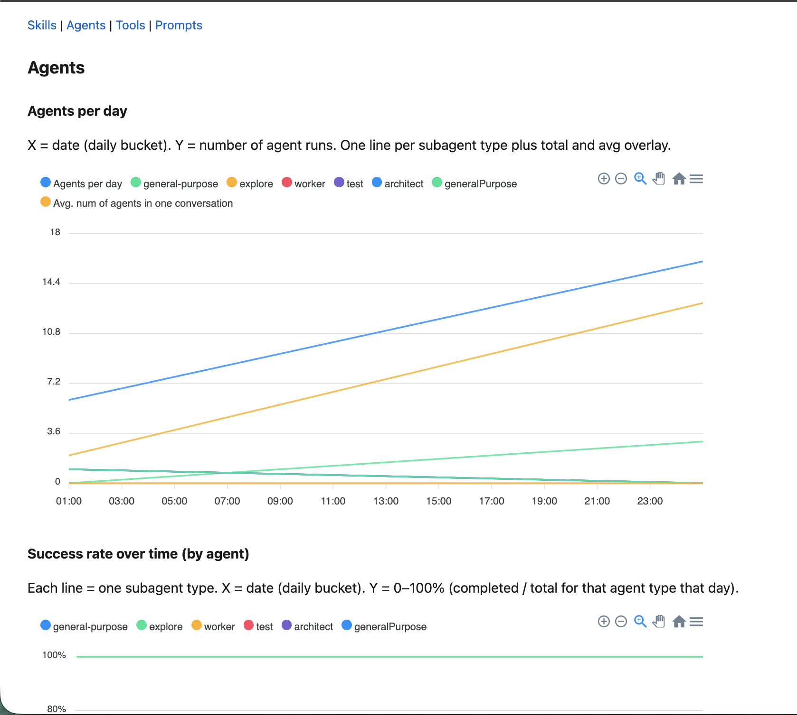

# One AI config to rule all repos

**How I stopped duplicating agents, skills, and rules across every repo - and why you might want to do the same.**

---

If you use an AI coding assistant - Cursor, Claude Code, Codeium, Windsurf, or similar - and maintain more than one project, you've probably felt the pain: 

You craft a solid set of rules, prompts, and agent definitions in one repo, and then you copy them into the next. And the next. Before long, you're maintaining five versions of the same config, and improvements in one place never make it to the others.

There's a better way.

## The idea: one root, many projects

Instead of scattering your AI config across each repo, put it in a **single root repository** and import your projects as **regular nested git clones**. Open that root in your editor, and every project inside it shares the same rules and definitions. Update once, apply everywhere.

*This repo is set up for Cursor (`.cursor/` with agents, skills, rules). The same pattern works for other tools - just swap in their config layout.*

```
agents/                    ← you open this
├── .cursor/               ← ONE definition of agents, skills, rules
│   ├── agents/
│   ├── rules/
│   └── skills/
├── my-api/                ← your projects (independent git clones)
├── my-dashboard/
├── my-scraper/
└── ...
```

All cloned projects are indexed together. The AI has full context. No duplication, no drift.

## Why nested clones (and not symlinks/submodules)?

You might think: "Can't I just symlink my projects into a mega folder?" You can, but many AI tools **don't index symlinks** - Cursor, for example, skips them, so the AI can't see the files. Nested git clones are real directories; they get indexed and everything works.

Each project keeps its own git history. The root repo stays focused on shared `.cursor/` config and ignores imported project folders via `.gitignore`. This keeps day-to-day git operations simple while preserving project isolation.

## Getting started

### 1. Clone this repo

```bash
git clone https://github.com/JuroOravec/agents.git
cd agents
```

### 2. Add your projects

```bash
git clone https://github.com/you/your-project.git your-project
echo "your-project/" >> .gitignore
```

Open the repo in Cursor. Your projects are now inside, sharing the same `.cursor/` config. Edit a skill once, and it applies to every project.

### 3. Switching focus when you have too many projects

Indexing and tooling can slow down with dozens of nested projects. You have two ways to change which projects are "active":

**Soft switch** - Toggle `.gitignore` so tooling skips projects you're not using. Add a path to deactivate, remove it to activate, reload the window. Your WIP stays local; no push, no commit. Use this when you just want to focus on 1–2 projects for a while.

```gitignore
# Soft-switch: project-a disabled, project-b active
project-a/
# project-b/
```

**Hard switch** - Remove one nested clone folder and clone another project. The AI will prompt you to store progress (commit & push) before removing, so you never lose work. Use this when you want to permanently drop a project from the root and bring in a different one.

### 4. Or let the AI do it

I added a [`root-project-setup`](./.cursor/skills/root-project-setup/SKILL.md) skill that makes this trivial: ask your AI to "add a project", "remove a project", or "switch projects", and it walks you through the nested-clone workflow, including asking whether you want soft or hard switch when it's unclear.

See [docs/project-setup.md](docs/project-setup.md) for the full guide.

## What's in the box

This repo contains AI agents, skills, and rules I used in other projects - development, scraping, packaging, releases, and more. They live in [`.cursor/skills/`](.cursor/skills/README.md). You can keep them, replace them, or fork the whole thing and make it yours.

The skills are tuned for **JavaScript/TypeScript projects using a pnpm monorepo**.

### Skill health metrics

Skills in this project emit health metrics when used.

You can open up a dashboard to see the health metrics.
See [docs/features/skill-usage-tracking/](docs/features/skill-usage-tracking/).


### Agent, tool, and prompt tracking

Beside the skills, also this project logs and displays also agent, tools, and propmpts use.

See [docs/features/telemetry/](docs/features/telemetry/) for the dashboard and individual pages



## Try it

Clone, add your first project, and open it in Cursor. One config. Many projects. No more copy-paste.
