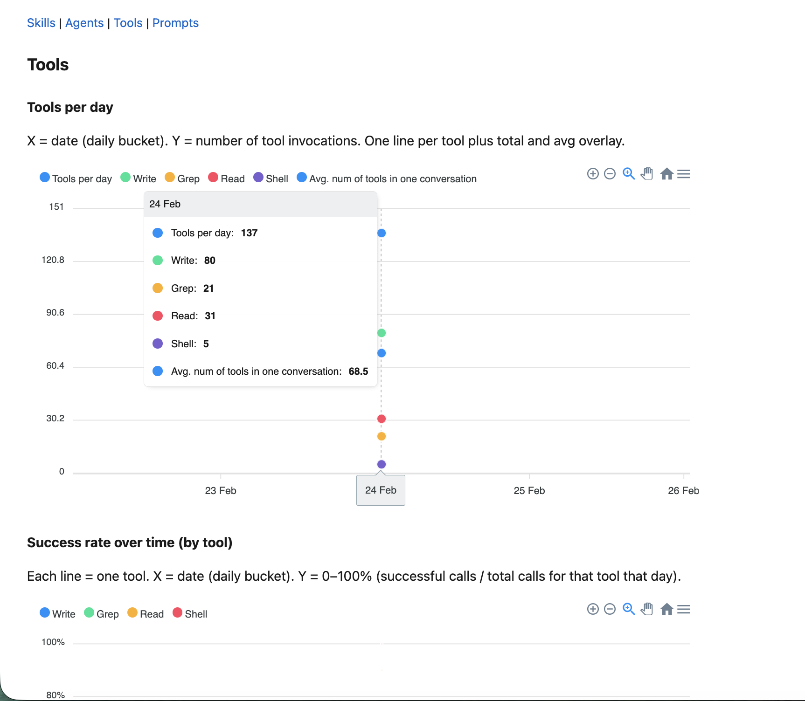
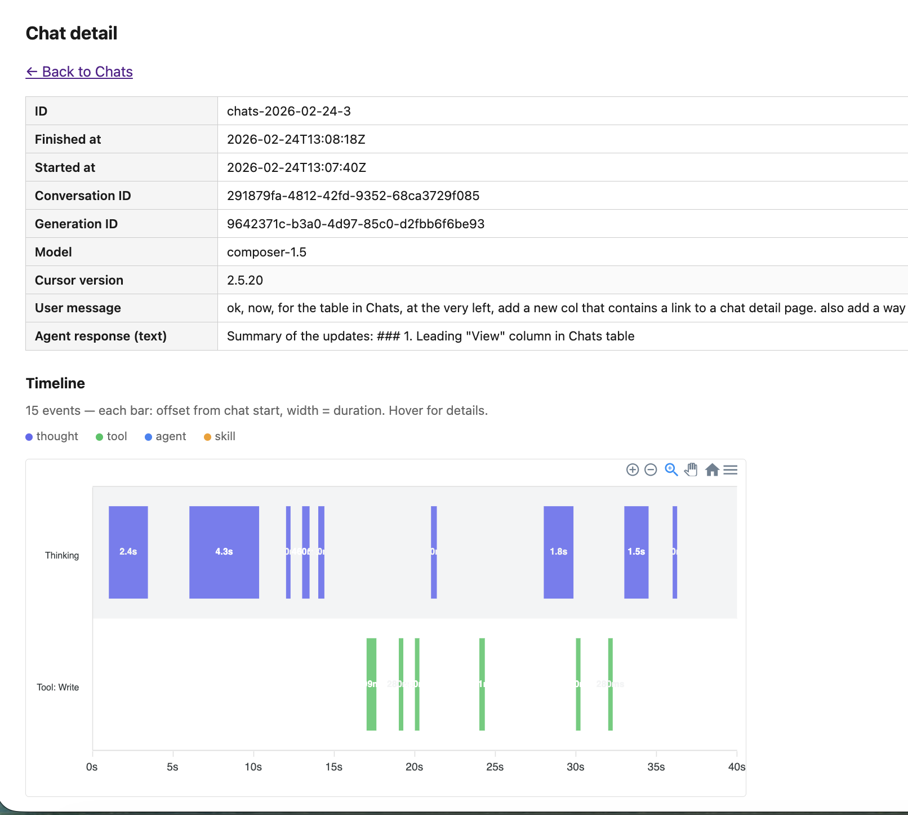
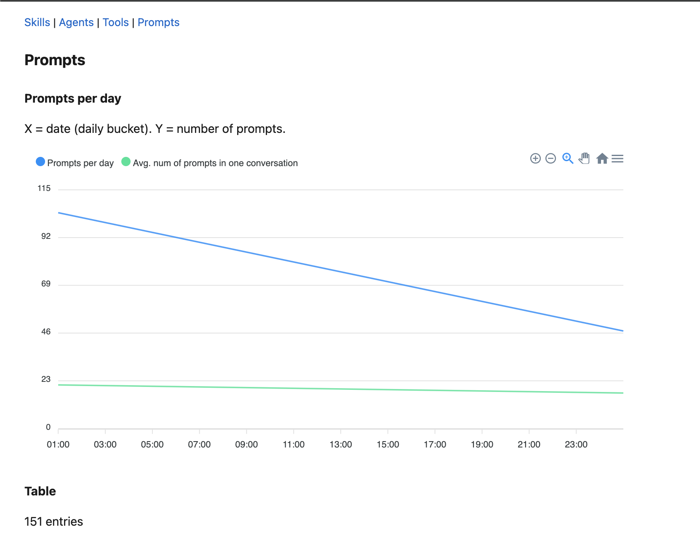

# Telemetry Dashboard

**The preview dashboard aggregates logs from Cursor hooks and exposes them as a local web UI. One place to inspect skill adherence, agent runs, tool calls, prompts, and chats.**



---

## Overview

Start the dashboard with:

```bash
pnpm run preview
# Or: pnpm run preview -- -p 3000
```

Open http://localhost:3040 (default port 3040).

Data is read from `.cursor/logs/`. Each page corresponds to a log source. Nothing is sent off-machine; everything stays local.

---

## Dashboard pages

### Chats (`/chats`)

**Data source:** `.cursor/logs/chats/chats-YYYY-MM-DD.jsonl` (agent responses) + prompt logs for backfill

Agent responses logged when the `afterAgentResponse` hook fires. Each row is one assistant message. `started_at` is backfilled from matching `beforeSubmitPrompt` logs (by `conversation_id` + `generation_id`); `user_message` is copied from the same prompt for context.

- **Chats per day chart** — X = date, Y = number of agent responses. Overlay: avg chats per conversation.
- **Table** — Columns: `finished_at`, `started_at`, `event`, `user_message`, `text`, `conversation_id`, `generation_id`, `model`, `cursor_version`
- **View link** — Each row has a "View" link to a detail page
- **Detail page** — Summary table + waterfall timeline of thoughts, tools, agents, and skills within that chat's time window. Color-coded by type; hover for metadata.
- **Filter** — JS expression (e.g. `obj.conversation_id === 'uuid'`)
- **Sort** — Click column headers; pagination



---

### Skills (`/skills`)

**Data source:** `.cursor/logs/skills/` (JSON files, one per skill run)

Shows meta-evaluation of skill adherence: whether agents complete each phase of a workflow.

- **Skills per day chart** — X = date, Y = number of skill runs. One line per skill plus total and avg overlay (above the heatmap).
- **Success rate over time (by skill)** — Each line = one skill. X = date (daily bucket), Y = 0–100% (runs that completed all phases / total for that skill that day).
- **Time in skill workflows (% of work time)** — Single line. X = date (daily bucket), Y = 0–100% (time spent in active skill workflows while working / total time spent working). Computes overlapping periods of chat sessions and skill runs by conversation_id.
- **Heatmap** — Rows = skills, columns = phases. Each cell is 0–100% success rate (green = 100%, red = 0%).
- **Table** — Columns: `created_at`, `finished_at`, `skill`, `skill_id`, `conversation_id`, `phases_completed`, `filename`. Filter (JS expression), sort (click headers), pagination.

Requires skill-eval setup. See [skill-usage-tracking](../skill-usage-tracking/README.md) for full setup.


---

### Agents (`/agents`)

**Data source:** `.cursor/logs/agents/agents-YYYY-MM-DD.jsonl`

Subagent runs (e.g. architect, worker) logged when the `subagentStop` hook fires.

- **Agents per day chart** — X = date, Y = number of agent runs. One line per subagent type plus total and avg overlay.
- **Success rate chart** — Each line = one subagent type. X = date, Y = 0–100% (completed / total, by status).
- **Table** — Columns: `finished_at`, `started_at`, `event`, `subagent_type`, `status`, `duration`
- **Filter** — JS expression to narrow entries (e.g. `obj.subagent_type === 'architect'`)
- **Sort** — Click column headers to sort; supports pagination


---

### Tools (`/tools`)

**Data source:** `.cursor/logs/tools/tools-YYYY-MM-DD.jsonl`

Tool invocations logged by the `postToolUse` and `postToolUseFailure` hooks.

- **Tools per day chart** — X = date, Y = number of tool invocations. One line per tool plus total and avg overlay.
- **Success rate chart** — Each line = one tool (Grep, Read, Write, Shell, etc.). X = date (daily bucket), Y = 0–100% (successful calls / total calls for that tool that day).
- **Table** — Columns: `finished_at`, `started_at`, `event`, `tool_name`, `tool_use_id`, `cwd`, `duration`, `model`, `tool_input`, `error_message`, `failure_type`, `is_interrupt`
- **Filter** — JS expression (e.g. `obj.tool_name === 'Shell'`)
- **Sort** — Click column headers; pagination

`tool_input` content is truncated to 100 chars in logs to keep files compact.


---

### Prompts (`/prompts`)

**Data source:** `.cursor/logs/prompts/prompts-YYYY-MM-DD.jsonl`

User prompts captured when the `beforeSubmitPrompt` hook runs (if capture-prompts is enabled).

- **Prompts per day chart** — Line chart. X = date (daily bucket), Y = number of prompts. Overlay: chat spread (unique conversations / prompts, 0–1 scaled).
- **Table** — Columns: `ts`, `conversation_id`, `generation_id`, `hook`, `last_turn_preview`, `context`, `user_message`
- **Filter** — JS expression (e.g. `obj.conversation_id === 'uuid'`)
- **Sort** — Click column headers; pagination



---

## Hook → log mapping

| Hook              | Script                  | Log location                                      |
| ----------------- | ----------------------- | ------------------------------------------------- |
| `sessionStart`    | session-init.sh         | Injects conversation_id into context (no file)   |
| `beforeSubmitPrompt` | capture-prompts.sh   | `.cursor/logs/prompts/prompts-YYYY-MM-DD.jsonl`   |
| `postToolUse`     | log-tools.sh            | `.cursor/logs/tools/tools-YYYY-MM-DD.jsonl`      |
| `postToolUseFailure` | log-tools.sh        | `.cursor/logs/tools/tools-YYYY-MM-DD.jsonl`      |
| `subagentStop`    | log-agents.sh           | `.cursor/logs/agents/agents-YYYY-MM-DD.jsonl`     |
| `afterAgentThought` | log-thoughts.sh       | `.cursor/logs/thoughts/thoughts-YYYY-MM-DD.jsonl` |
| `afterAgentResponse` | log-chats.sh         | `.cursor/logs/chats/chats-YYYY-MM-DD.jsonl`      |
| Skill-eval CLI    | skill-eval.sh            | `.cursor/logs/skills/` (JSON per run)            |

---

## Further reading

- [skill-usage-tracking](../skill-usage-tracking/README.md) — Full skill-eval setup guide
- [Agent and tool tracking design](../../design-decisions/agent-tool-tracking/README.md) — Data model and hooks
