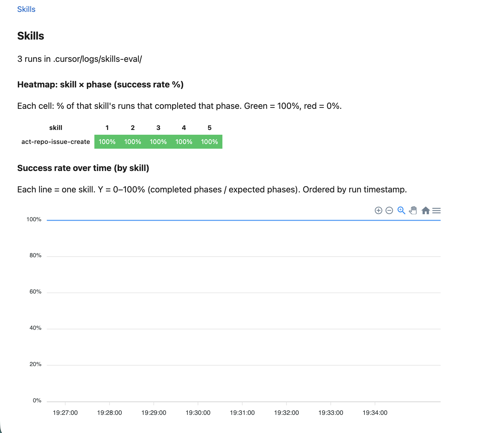

# How to Track Cursor Skill Usage and Completion — A to Z

**Turn your AI agent’s skill workflows into measurable data. See which phases succeed, which get skipped, and how adherence changes over time.**

---

If you use Cursor with custom skills—those step-by-step workflows that guide your AI through multi-phase tasks—you’ve probably wondered: *does the agent actually follow them?* Do they complete each phase, or do they skip steps, merge phases, or go off-script? Without data, it’s guesswork. You tweak skill text, hope for the best, and never really know if it helped.

This guide shows how to set up **skill usage tracking** from scratch: how to log which phases were completed or skipped, where the data lives, and how to preview it in a simple dashboard. By the end, you’ll have a system that answers: *are agents going in the right direction?*

---

## What you’ll get

- **Track workflows step-by-step** — Which steps completed, which were skipped, and when
- **A preview dashboard** — Heatmap (skill × phase success rate) and line chart (adherence over time)
- **CI job that checks skill conformity** — Skills use a consistent structure so tracking is reliable
- **Structured logs** — JSON files in `.cursor/logs/skills-eval/` for every skill run

---



---

## Why this matters

Skills encode domain knowledge and best practices. When an agent skips a phase (e.g. “check for duplicates” before creating an issue), things break. When they merge steps or invent shortcuts, outcomes degrade. Without visibility, you can’t tell if a skill is poorly written, if the model ignores it, or if the task itself is ambiguous.

Tracking gives you:

1. **Evidence-based improvement** — “Phase 3 has 40% completion” → refine that phase
2. **Skill/model fit** — Low adherence might mean the skill doesn’t match model behavior
3. **Trends over time** — Did last week’s skill edit improve Phase 2 completion?

---

## Prerequisites

- **Cursor** (or compatible AI editor with hooks)
- **Bash**, **jq**, and **Node.js** (for the preview dashboard)
- A project with `.cursor/` config (agents, skills, rules)
- Skills that use workflows

### Required format for workflow phases

In this article I talk about "phases". Phases are simply workflow steps.

For tracking to work, skills must have special structure:

```markdown
## Workflow
### Phase N: Title
### Phase Na: Title   (optional a/b suffix for sub-steps)
```

Example:
```markdown
## Workflow
...

### Phase 1: Classify
...

### Phase 2: Check duplicates
### Phase 2a: Soft switch
```

This is solely so that we can parse the steps
by code. Otherwise we'd need an LLM model just to parse the steps from a workflow.

So do not use `### 1. Step` or `### Adding a dependency` - the validation script will fail. 

CI enforces this format across all skills.

---

## Step 1: Setup the `session-init` hook

We use Cursor's `session_id` to know in which chat a skill runs.

Without `session_id`, we'd be cooked if you ran multiple parallel agents.

`session_id` is available at session start via Cursor’s `sessionStart` hook.

### 1.1 Create the hook script

Create `.cursor/hooks/session-init.sh`:

```bash
#!/usr/bin/env bash
# session-init: Injects session_id (conversation_id) into agent context at session start.
# Agents use session_id when calling skill-eval start.
set -e

payload=$(cat)
session_id=$(echo "$payload" | jq -r '.conversation_id // ""')

if [[ -z "$session_id" ]]; then
  echo "session-init: no conversation_id in payload, skipping injection" >&2
  echo '{"continue": true}'
  exit 0
fi

additional_context="**Session ID (for skill-eval):** \`$session_id\`

When following phased skills (e.g. act-repo-issue-create), run \`skill-eval start $session_id <skill_name>\` at workflow start. Preserve this session_id and the returned skill_id in context for \`skill-eval complete\` calls."

jq -n \
  --arg session_id "$session_id" \
  --arg additional_context "$additional_context" \
  '{continue: true, additional_context: $additional_context}'
```

Make it executable:

```bash
chmod +x .cursor/hooks/session-init.sh
```

### 1.2 Register the hook

Edit `.cursor/hooks.json` and add `sessionStart`:

```json
{
  "version": 1,
  "hooks": {
    "sessionStart": [
      {
        "command": ".cursor/hooks/session-init.sh"
      }
    ]
  }
}
```

**Reload Cursor** (Cmd+Shift+P → “Developer: Reload Window”) so the hook is picked up.

---

## Step 2: Add the `skill-eval` CLI

We want to log the exact times when individuals steps of the workflow were completed.

But relying on an agent to provide you with correct time is dangerous.

Instead, we define a bash script that the agent can call.

File editing, timestamp, and everything else is handled by this script.

The agent calls a script instead of editing JSON.

### 2.1 Create the script

Create `scripts/skill-eval.sh` in your repo root. Copy the full implementation from [scripts/skill-eval.sh](../../scripts/skill-eval.sh) in this repo.

It has 2 commands:

- `start` → Starts tracking skill workflow, creates a JSON file, prints `skill_id`
  ```sh
  start {session_id} {skill_name}
  ```

- `complete` → Marks a step as completed
  ```sh
  complete {skill_id} {phase_no} [--skipped]
  ```

Requires `jq`; install with `brew install jq` (macOS) or your package manager.

### 2.2 Test it

```bash
./scripts/skill-eval.sh start test-session-123 act-repo-issue-create
# Prints a UUID, e.g. a1b2c3d4-5678-90ab-cdef-1234567890ab

./scripts/skill-eval.sh complete a1b2c3d4-5678-90ab-cdef-1234567890ab 1

./scripts/skill-eval.sh complete a1b2c3d4-5678-90ab-cdef-1234567890ab 2 --skipped
```

Check `.cursor/logs/skills-eval/` — you should see a JSON file with `steps` containing phases 1 and 2.

---

## Step 3: Use predefined titles for workflow steps in skills

For tracking to work, every skill must define the workflow step with titles like this:

```markdown
## Workflow
...
### Phase 1: Classify
...
### Phase 2: Check duplicates
...
### Phase 3a: Optional suffix
...
### Phase 3b: Alternative
```

### 3.1 Format rules

- Each step: `### Phase N: Title`
- Optional suffix: `### Phase 2a: Maybe A`, `### Phase 2b: Maybe B`
- No other formats: not `### 1. Step` or `### Adding a dependency`

### 3.2 Add the preamble to each phased skill

Agents might forget to log their progress. So we need to remind them. Put this preamble at the start of `## Workflow` section:

```markdown
## Workflow

**Format:** All skills MUST use `### Phase N: Title` for each workflow step. Enforced by validation script in CI.

**Skill-eval (meta-evaluation):** From the project root, run `./scripts/skill-eval.sh start {session_id} {skill-name}` at workflow start (session_id is injected at session start—look for "Session ID (for skill-eval)" in context). Capture the printed `skill_id` from the terminal output. Preserve both `session_id` and `skill_id` for the duration—if context gets summarized, ensure these IDs are retained. After each phase (or when skipping a phase), run `./scripts/skill-eval.sh complete {skill_id} {phase_no}` or `./scripts/skill-eval.sh complete {skill_id} {phase_no} --skipped` from the project root.

Create todo tasks for each phase before proceeding.
```

Replace `{skill-name}` with the skill’s directory name (e.g. `act-repo-issue-create`).

### 3.3 Validate

```bash
pnpm run validate   # or: npx tsx scripts/validate/index.ts
```

This runs `scripts/validate/skill-phases.ts` and fails if any skill uses a non-Phase heading under `## Workflow`.

---

## Step 4: What the agent does at runtime

1. **Session start** — Cursor runs `session-init.sh`, which injects `Session ID (for skill-eval): …` into the conversation.

2. **Workflow start** — When the agent begins a phased skill, it runs:
   ```bash
   ./scripts/skill-eval.sh start {session_id} act-repo-issue-create
   ```
   It captures the printed `skill_id` and keeps it in context.
3. **After each phase** — The agent runs:
   ```bash
   ./scripts/skill-eval.sh complete {skill_id} 1
   ./scripts/skill-eval.sh complete {skill_id} 2 --skipped   # if it skips
   ```
4. **Progression logs** — Each time the agent calls the `complete` command, this is logged. In the end, the log file for this workflow will look like this:

    ```json
    // 20260223T183529Z_act-repo-issue-create_6703f819-407b.json
    {
      "createdAt": "2026-02-23T18:35:29Z",
      "session_id": "1b5c6ca3-4402-4013-a193-484059076602",
      "skill_id": "6703f819-407b-4684-aabc-899b1206bf0f",
      "skill": "act-repo-issue-create",
      "steps": [
        {
          "phase": 1,
          "completedAt": "2026-02-23T18:35:37Z"
        },
        {
          "phase": 2,
          "completedAt": "2026-02-23T18:35:37Z"
        },
        {
          "phase": 3,
          "completedAt": "2026-02-23T18:35:37Z"
        },
      ]
    }
    ```

---

## Step 5: Preview the data

Start the dashboard:

```bash
npm run preview
# Or: npm run preview -- -p 3000   to use port 3000
```

Open http://localhost:3040/skills.

### What you’ll see

- **Heatmap** — Rows = skills, columns = phases. Each cell is 0–100% success rate (green = 100%, red = 0%). Shows how often each phase was completed across all runs of that skill.
- **Line chart** — Each line = one skill. X = time, Y = success rate (completed phases / expected phases). Shows adherence trends over time.

Data is read from `.cursor/logs/skills-eval/`. Each JSON file is one skill run; the dashboard aggregates them and computes metrics from your `SKILL.md` phase definitions.


---

## Troubleshooting

| Issue | Check |
| ----- | ----- |
| Agent doesn’t see session_id | Reload Cursor after editing hooks; verify `sessionStart` in `hooks.json` |
| `skill-eval: no file found for skill_id` | Agent lost `skill_id`; ensure preamble says “preserve session_id and skill_id in context” |
| Empty dashboard | No JSON files yet; run a phased skill and complete at least one phase |
| Phase validation fails | Run `pnpm run validate`; fix non-Phase headings under `## Workflow` |
| `jq: command not found` | Install jq: `brew install jq` or `apt install jq` |

---

## Next steps

- **Add more skills** — Apply the preamble to every phased skill; validation will enforce the format.
- **Review regularly** — Use the dashboard to spot low-adherence phases and refine skill text.
- **Extend the dashboard** — Future: Agents page, Prompts page, CSV export for trending.

---

## Further reading

- [meta-evaluation-skill-adherence-design.md](../design-decisions/meta-evaluation-skill-adherence-design.md) — Design rationale and data model
- [Development README](../development/README.md) — Skill-eval dashboard, validation, and commands
- [Cursor hooks](../cursor-hooks.md) — Hook lifecycle and reload behavior
